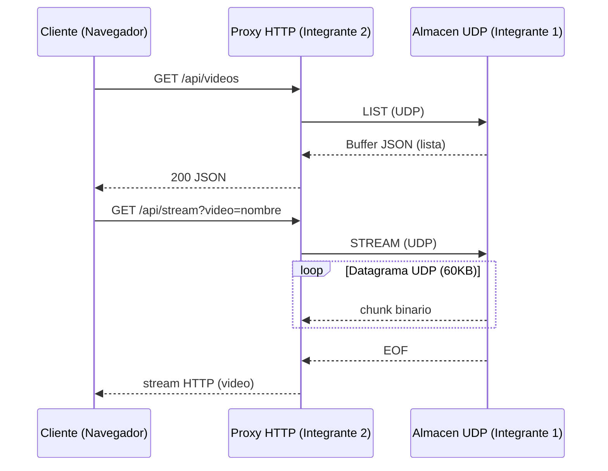

# Cliente UDP (Frontend)

## Diagrama de secuencia

## Justificacion del proxy

- El navegador no permite sockets UDP nativos por seguridad y sandboxing.
- El proxy HTTP traduce peticiones REST a comandos UDP, permitiendo compatibilidad web.
- El streaming se expone como HTTP para que el reproductor nativo pueda consumirlo.

## Parametros de red

- Puerto UDP: 5001
- Tamano de paquete (buffer): 60KB (highWaterMark)
- Control de congestion: delay de 1-2 ms entre datagramas
- Fin de transmision: datagrama especial "EOF"

## QA - Banco de pruebas

- Formatos sugeridos: .mp4, .mkv, .avi, .mov
- Criterio: la reproduccion inicia en menos de 2 segundos
- Carpeta de pruebas: server/videos
- Nota: el cliente lista y solicita cualquier extension, pero la reproduccion depende del soporte del navegador
